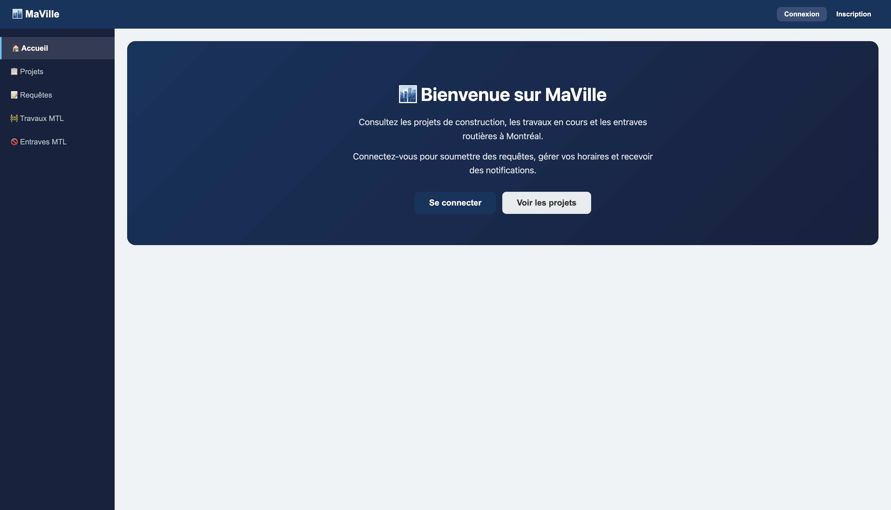
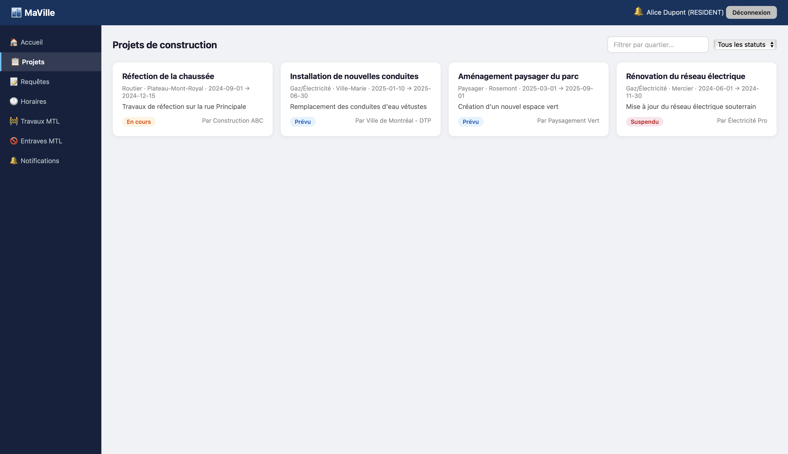
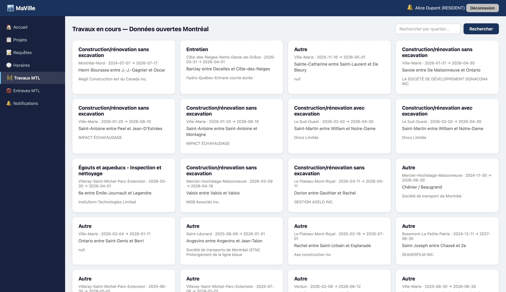

# MaVille — Plateforme de gestion des travaux de Montréal

MaVille est une application web permettant aux résidents et intervenants de la ville de Montréal de consulter, soumettre et gérer des projets de construction et des requêtes de travaux.

## Fonctionnalités

- **Page d'accueil publique** — consultation des projets et requêtes sans authentification, avec filtres par quartier, statut et type de travaux
- **Authentification JWT** — inscription et connexion sécurisées pour résidents et intervenants
- **Gestion des projets** — création, consultation et mise à jour du statut des projets (intervenants)
- **Gestion des requêtes** — soumission de requêtes de travaux (résidents), candidatures (intervenants)
- **Horaires de travail** — configuration des préférences horaires par les résidents
- **Notifications** — alertes en temps réel pour les utilisateurs concernés
- **Données ouvertes de Montréal** — recherche de travaux et entraves via l'API ouverte de la ville

## Aperçu / Screenshots

### Page d'accueil et tableau de bord


### Consultation des projets de construction


### Travaux en cours - Données ouvertes de Montréal


## Prérequis

- **Java 17** ou plus récent
- **Maven 3.8+** 

## Démarrage rapide

```bash
# Compiler le projet
./mvnw clean compile

# Lancer l'application
./mvnw spring-boot:run
```

## Comptes de test

L'application inclut des données de démonstration. Mot de passe pour tous les comptes : `password123`

| Courriel | Rôle |
|---|---|
| alice@mail.com | Résident |
| bob@mail.com | Résident |
| charlie@mail.com | Résident |
| abc@construction.com | Intervenant |
| info@electro.com | Intervenant |

## Architecture

```
src/main/java/com/maville/
├── config/          # DataSeeder (données initiales)
├── controller/      # Contrôleurs REST (Auth, Projets, Requêtes, etc.)
├── dto/             # Objets de transfert (requêtes/réponses)
├── model/           # Entités JPA (User, Projet, Requête, etc.)
├── repository/      # Interfaces Spring Data JPA
├── security/        # JWT (génération, filtrage) et configuration Spring Security
├── service/         # Logique métier
└── MaVilleApplication.java

src/main/resources/
├── static/          # Interface web (HTML, CSS, JS)
└── application.yml  # Configuration
```

## Stack technique

- **Backend** — Spring Boot 3.2.5, Spring Security, Spring Data JPA
- **Base de données** — H2 en mémoire
- **Authentification** — JWT, BCrypt
- **Frontend** — HTML / CSS / JavaScript
- **API externe** — Données ouvertes de Montréal (travaux et entraves) https://donnees.montreal.ca/dataset/info-travaux
